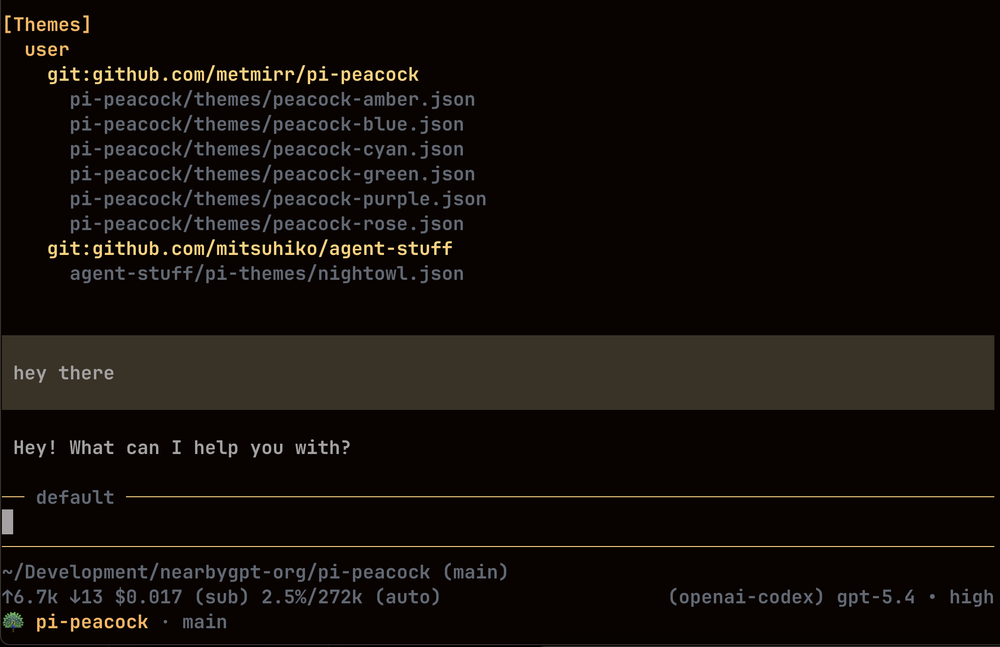

# pi-peacock

Peacock-style workspace coloring for [pi coding agent](https://pi.dev).

`pi-peacock` is for people who work in **multiple repos or multiple pi sessions** and want each workspace to be instantly recognizable, similar to the VS Code Peacock extension.

It gives pi a repo identity by:

- switching to a repo-specific theme
- showing a colored repo badge in the footer
- setting the terminal title to the current repo and branch

So instead of every pi session looking the same, your backend repo can feel orange, your frontend blue, your extension purple, and so on.

## Screenshot



_pi-peacock giving the current workspace its own color, footer badge, and title identity inside pi._

## What this package is for

If you regularly work across:

- multiple git repos
- a monorepo with several apps
- staging vs production workspaces
- client projects in separate terminals

then `pi-peacock` helps you distinguish them at a glance without relying on memory or terminal tab names alone.

It is especially useful when you often have several pi windows open at once.

## What it changes

`pi-peacock` changes **pi's own UI identity**, not your editor or terminal theme globally.

It can:

- apply a different **pi theme** per repo
- show a persistent **footer/status badge**
- set the **terminal title**

It does **not** try to recolor your terminal application's native window chrome, since that is terminal-dependent and not reliably portable.

## Features

- **automatic repo coloring** with zero config
- **stable theme assignment** by hashing the git repo name
- **bundled themes** ready to use out of the box
- **per-repo overrides** via `peacock.json`
- **project + global config** support
- **publishable pi package** for npm/git installs

## Included themes

- `peacock-amber`
- `peacock-blue`
- `peacock-cyan`
- `peacock-green`
- `peacock-purple`
- `peacock-rose`

These themes are tuned for dark terminals and make border/accent differences obvious without being overly noisy.

## Install

### From npm

```bash
pi install npm:pi-peacock
```

### From git

```bash
pi install git:github.com/metmirr/pi-peacock
```

### From a local checkout

```bash
pi install ./pi-peacock
```

### Try without installing

```bash
pi -e ./pi-peacock
```

## Quick start

You can use `pi-peacock` with **no config at all**.

Once installed, it will:

1. detect the current git repo
2. pick one of the bundled themes
3. apply that theme consistently for that repo
4. show repo + branch information in pi's UI

If you want fixed mappings, add a config file.

## Configuration

`pi-peacock` looks for config in:

- `~/.pi/agent/peacock.json`
- `<git-root>/.pi/peacock.json`

Project config overrides global config.

## Minimal config

```json
{
  "rules": [
    { "repo": "nearbygpt-backend", "theme": "peacock-amber", "label": "backend" },
    { "repo": "nearbygpt-pwa", "theme": "peacock-blue", "label": "pwa" },
    { "repo": "chrome-extension", "theme": "peacock-purple", "label": "extension" },
    { "repo": "mapsense-app", "theme": "peacock-green", "label": "mapsense" }
  ]
}
```

## Full config

```json
{
  "autoAssignTheme": true,
  "fallbackTheme": "dark",
  "fallbackLabel": "workspace",
  "showBranch": true,
  "showStatus": true,
  "showTitle": true,
  "titlePrefix": "π",
  "rules": [
    {
      "repo": "nearbygpt-backend",
      "theme": "peacock-amber",
      "label": "backend",
      "title": "π {label} · {branch}",
      "status": "backend"
    },
    {
      "pathIncludes": ["/work/client-a/", "/work/client-b/"],
      "theme": "peacock-cyan",
      "label": "client-work"
    }
  ]
}
```

## Rule fields

Each rule can contain:

- `repo`: exact git repo folder name
- `pathIncludes`: string or array of substrings matched against `cwd` and git root
- `theme`: theme name to switch to
- `label`: short name used for footer/title
- `title`: custom title template
- `status`: custom footer label/template

Available placeholders in `title` and `status`:

- `{repo}`
- `{branch}`
- `{label}`
- `{cwd}`
- `{gitRoot}`

## Command

### `/peacock`

Re-applies the current repo identity and shows which theme/config source is active.

Useful when:

- you changed config and want to refresh
- you manually switched themes and want pi-peacock to take over again
- you want to verify which rule matched

## NearbyGPT example

An example config for this monorepo is included at:

- `examples/nearbygpt-peacock.json`

## Package structure

This package ships with:

- `extensions/repo-peacock.ts` — the pi extension
- `themes/*.json` — bundled peacock themes
- `examples/nearbygpt-peacock.json` — sample repo mapping config

## Publish

### Publish to npm

```bash
npm publish
```

### Publish as a pi package on GitHub

After pushing the repo to GitHub, users can install it directly with:

```bash
pi install git:github.com/metmirr/pi-peacock
```

The package already includes the `pi-package` keyword so it is ready to be distributed as a pi package.

## Notes

- If no rule matches, `pi-peacock` auto-picks one of the bundled themes.
- If you switch git branches during a session, the footer/title updates after the current turn.
- If you manually change theme in pi, `pi-peacock` will re-apply when identity changes or when you run `/peacock`.
